# How to record with the Miniscope DAQ Software

## Overview

**Miniscope DAQ Software v2.0.0** records Miniscope and behavior-camera data. It is one window with two modes: **Setup**, where you load and edit a configuration, and **Acquire**, where the session runs.

<p align="center">
  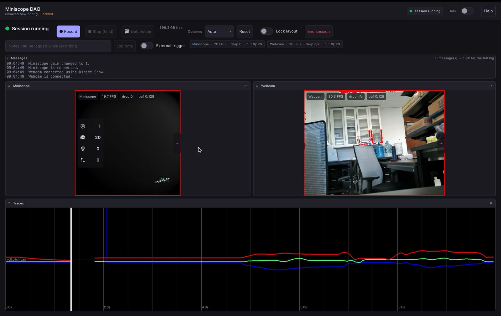
</p>

**Download:** [v2.0.0 release page](https://github.com/Aharoni-Lab/Miniscope-DAQ-QT-Software/releases/tag/v2.0.0) — Windows, Linux and macOS builds, each self-contained.

> [!NOTE]
> **Quick start**
>
> 1. Connect scope → DAQ → computer, then launch the software.
> 2. *Open…* one of the six configurations in `~/Documents/Miniscope/userConfigs`.
> 3. **Scan devices** and set each device's ID.
> 4. Check the destination path is green, then **Save**.
> 5. **▶ Run** → **● Record**.

Every screenshot below is annotated, and the numbers on the image match the numbered list under it.

**Contents**

- [Overview](#overview)
- [Install](#install)
- [Check the hardware first](#check-the-hardware-first)
- [Build a configuration](#build-a-configuration)
- [Run a session](#run-a-session)
- [Find your data](#find-your-data)
- [Troubleshooting](#troubleshooting)
- [See also](#see-also)

## Install

| Platform | File | Notes |
| --- | --- | --- |
| Windows | `MiniscopeDAQ-v2.0.0-Setup.exe` | Per-user install, no admin rights. A portable `.zip` is also published |
| Linux | `Miniscope_DAQ-2.0.0-x86_64.AppImage` | `chmod +x` and run from a terminal |
| macOS | `Miniscope-DAQ-2.0.0-macOS-arm64.dmg` | Apple Silicon. Needs the one-time step below |

**macOS first launch.** The app is not notarized, so macOS quarantines it and refuses to open it ("cannot verify the developer" or "is damaged" — both mean the same flag). Clear it once from Terminal; no admin password needed:

```bash
xattr -dr com.apple.quarantine /Applications/MiniscopeDAQ.app
```

**Linux USB permissions.** Only needed for headless or remote sessions, or if you hit a USB access error — then re-plug the scope:

```bash
sudo cp packaging/linux/99-miniscope.rules /etc/udev/rules.d/
sudo udevadm control --reload-rules && sudo udevadm trigger
```

First launch creates `~/Documents/Miniscope/userConfigs` (seeded with six ready-to-run configurations, plus `Reference-AllOptions.json` documenting every key) and `~/Documents/Miniscope/data`.

## Check the hardware first

Connect the scope to the DAQ **before** plugging the DAQ into the computer, and launch the software last.

<p align="center">
  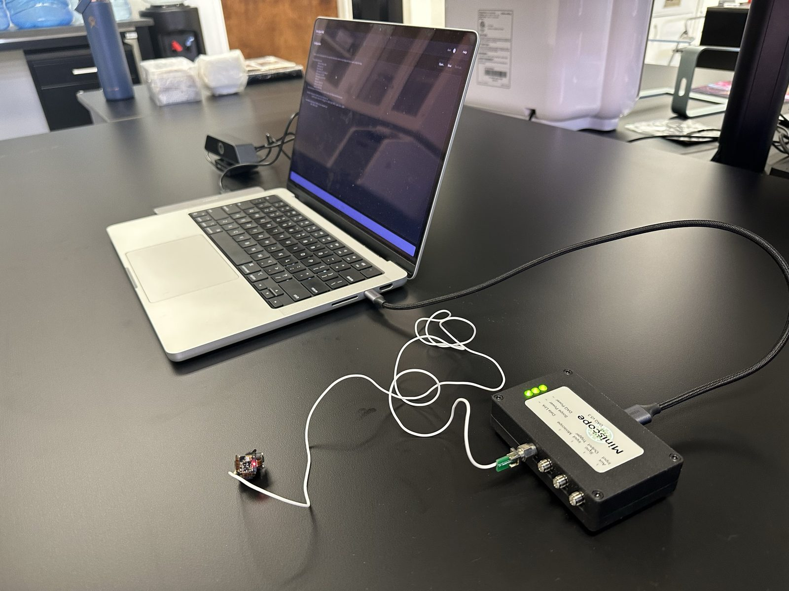
</p>

> [!WARNING]
> **All three DAQ LEDs should be lit** — DAQ Power, Scope Power, Data Link. DAQ Power alone means the scope is not powered; a missing Data Link usually means a coax problem. Fix this before troubleshooting in software.

## Build a configuration

### The Setup screen

<p align="center">
  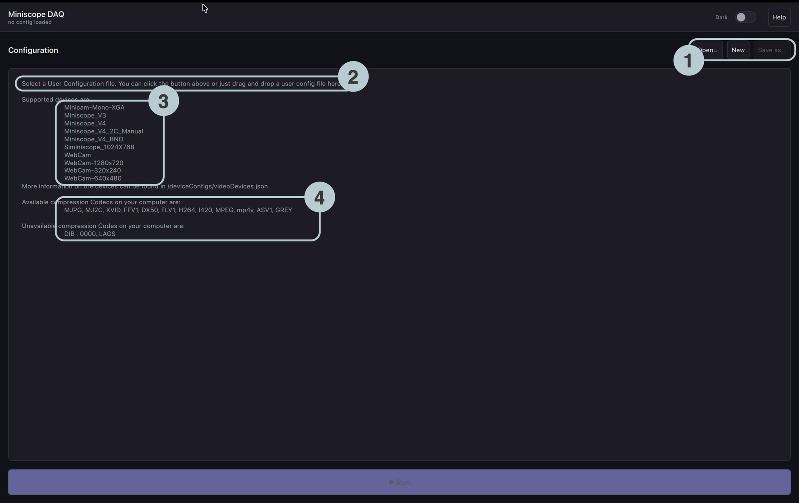
</p>

1. **Open…, New, Save as…** — load a configuration, start a blank one, or save under a new name.
2. **Drag and drop** a `.json` configuration onto the panel instead.
3. **Supported device types** for this build. Use `Miniscope_V4_BNO` for a V4.
4. **Codecs this computer can write.** A configuration naming an unavailable codec is refused before the session starts — check this when moving a configuration between rigs.

### The form editor

<p align="center">
  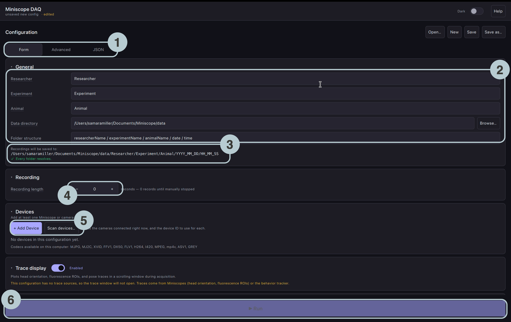
</p>

1. **Form / Advanced / JSON** — Form covers a normal session; Advanced holds the behavior tracker and record-start/stop programs; JSON exposes every key.
2. **General** — researcher, experiment and animal names, the data directory, and which become folders.
3. **Destination preview** — the fully expanded path, with a check that every folder resolves.
4. **Recording length** in seconds. `0` records until you press Stop.
5. **Devices** — add at least one, and use *Scan devices* to find its ID.
6. **Run** — starts the session.

> [!WARNING]
> **Check the destination preview is green before every session.** A field left empty writes a folder named `animalNameMissing` and nothing fails at record time to tell you. Underscores are safer than spaces, which become part of the folder name.

### Find the device IDs

<p align="center">
  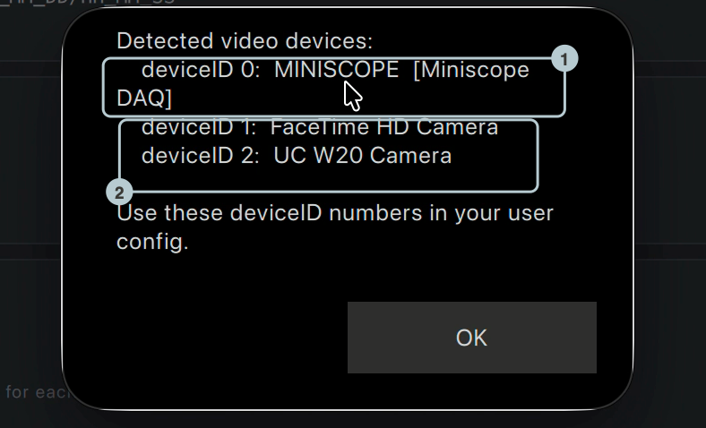
</p>

1. **Miniscope DAQ hardware is named as such**, so you can tell a scope from a camera.
2. **Cameras** are listed with the `deviceID` to put in the configuration.

> [!WARNING]
> **Re-scan whenever you change what is plugged in.** IDs come from the operating system in enumeration order, so they shift when any camera is added, removed or re-plugged — including a laptop's built-in one.

### Add a device

<p align="center">
  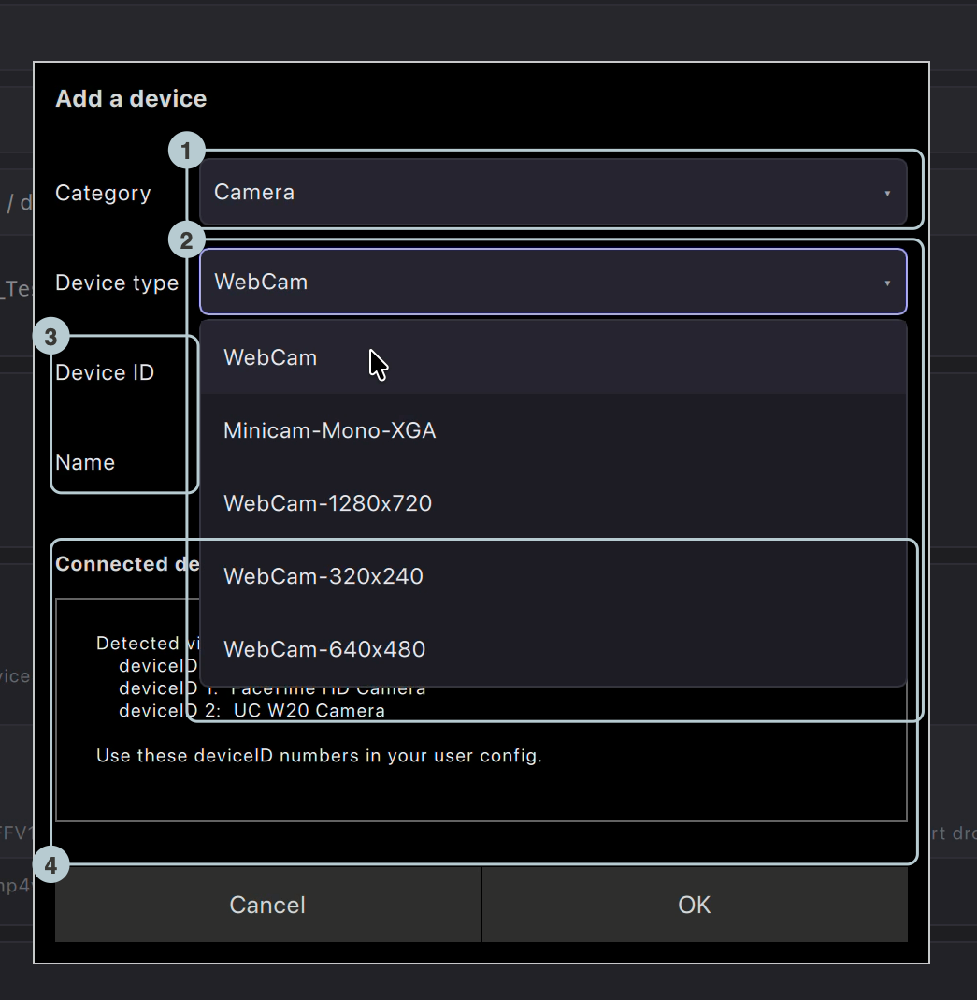
</p>

1. **Category** — Miniscope or Camera; it filters the type list.
2. **Device type** — `Miniscope_V4_BNO` for a V4 (the V4 with head orientation, which feeds the trace display and the commutator).
3. **Device ID and Name.** The name becomes a folder name in every recording, so it must be unique — duplicates are refused with the reason shown.
4. **Connected devices**, repeated here so you can match ID to camera.

### Codecs

<p align="center">
  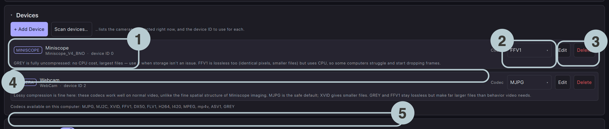
</p>

1. **Class, type and device ID.**
2. **Codec**, per device.
3. **Edit / Delete** — expand the row's settings, or remove it.
4. **Codec guidance** for that device class.
5. **Codecs available on this computer.**

| Codec | Lossless | Use for |
| --- | --- | --- |
| **GREY** | Yes | Miniscope. No CPU cost, largest files. Fall back to this if a computer struggles |
| **FFV1** | Yes | Miniscope. Same pixels as GREY, smaller files, but compression costs CPU |
| **MJPG** | No | Behavior video. The safe default |
| **XVID** | No | Behavior video, smaller than MJPG |

> [!CAUTION]
> **Miniscope data must stay lossless — GREY or FFV1.** Lossy codecs destroy the fine spatial structure cell extraction depends on. Lossy is fine for behavior video. If FFV1 drops frames, switch that device to GREY before blaming the hardware.

### Per-device settings

<p align="center">
  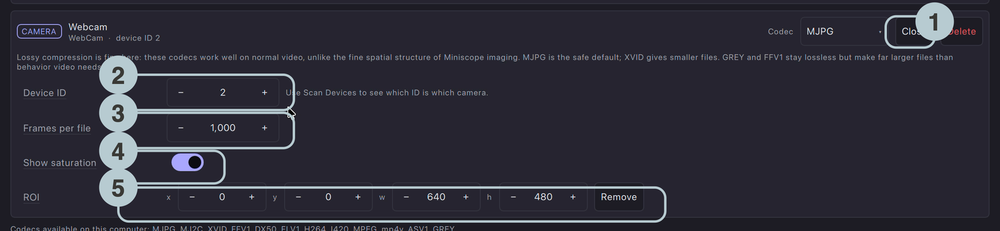
</p>

1. **Close** collapses the row.
2. **Device ID.**
3. **Frames per file** — frames per `.avi` before the recorder rolls over. Default 1000.
4. **Show saturation** in the live view.
5. **ROI** — crop what is recorded, or use *Full sensor*.

A Miniscope row adds **Gain**, **Frame rate**, **Excitation LED**, **EWL focus**, **Display colormap** (live view only) and **Head orientation** (writes `headOrientation.csv`).

Then **Save**, and **▶ Run**. Running with unsaved edits prompts you first; save, or the configuration behind the recording is not on disk anywhere.

## Run a session

### What you see

<p align="center">
  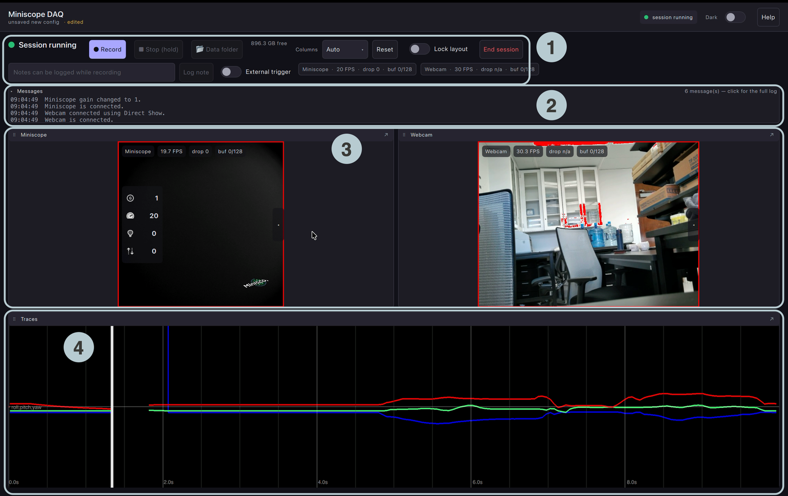
</p>

1. **Session bar** — transport, clock, notes, free space, telemetry.
2. **Messages** — last four, coloured by severity. Click for the full log.
3. **One pane per device.**
4. **Traces** — head orientation, fluorescence ROIs, pose.

Cameras take a few seconds each to open, so expect a short wait after Run. Ending the session returns you to Setup.

### The session bar

<p align="center">
  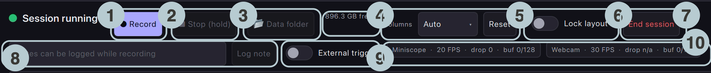
</p>

1. **Record** — start recording.
2. **Stop (hold)** — hold it until the press registers, so a stray click cannot end a recording.
3. **Data folder** — opens the folder being written to, during or after.
4. **Free space** on the recording volume.
5. **Columns / Reset** — panes per row; back to the automatic grid.
6. **Lock layout** — freeze the arrangement.
7. **End session** — close every device, back to Setup.
8. **Notes / Log note** — timestamped notes into `notes.csv`.
9. **External trigger** — recording follows the scope's trigger input.
10. **Per-device chips** — FPS, dropped frames, buffer use.

> [!WARNING]
> **Watch the buffer chip, not just the dropped-frame count.** Each device has 128 buffer slots between capture and disk. A buffer that climbs and stays high means frames are *about* to be lost; the dropped count only tells you afterwards. On FFV1 that usually means the CPU cannot keep up — switch to GREY.

### A video pane

<p align="center">
  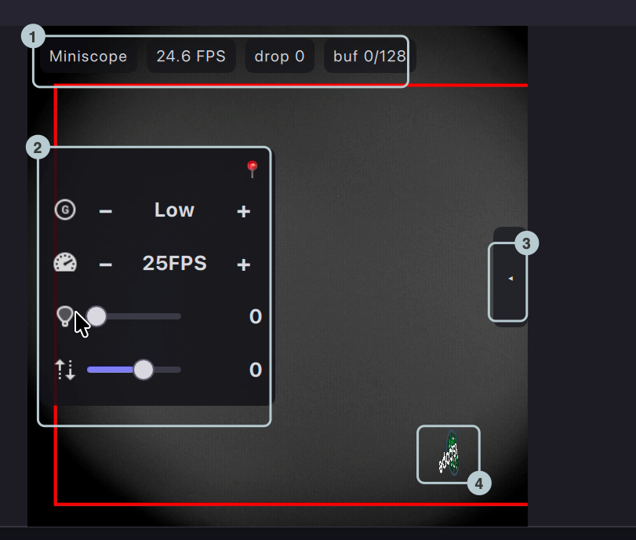
</p>

1. **Status chips** — name, FPS, dropped frames, buffer. **REC** joins them while recording.
2. **Hardware dock** — gain, frame rate, excitation LED, EWL focus. These change the **recorded** data. Hover or pin to reveal the controls.
3. **Display rail** — see below.
4. **Head orientation**, rotating with the scope.

The **display rail** on the right edge affects the live view only, never the recording: contrast and brightness, **Saturation**, **Colormap**, **ΔF/F**, **Screenshot** (or press **Space**), **Recording ROI…** (drag a region on the video), **+ Trace ROI…** and **Properties…**

> [!NOTE]
> **ΔF/F is the fastest way to confirm you have signal.** A raw frame from a healthy prep often looks like a near-uniform grey field; with ΔF/F on, transients are obvious.

Panes can be resized by dragging the dividers, reordered by dragging a pane's header, and popped out into their own windows. The arrangement is saved **per configuration file**, so a rig comes back the same way every run.

### Recording

<p align="center">
  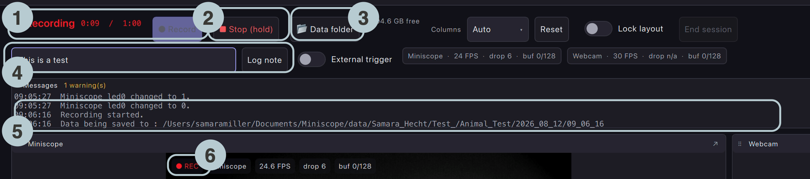
</p>

1. **Clock and target** — elapsed time, and the configured length if set.
2. **Stop (hold)** — armed; *End session* is disabled until it stops.
3. **Data folder** — opens the folder being written to.
4. **Note / Log note.**
5. **The message log** reports the exact path being written to.
6. **REC** on every recording pane.

The recorder refuses to start below **500 MB** free and stops cleanly, data preserved, below **250 MB**. Stopping drains the buffer first, so give it a moment before ending the session.

## Find your data

Recordings go to `dataDirectory`, one folder level per token: `‹data›/‹researcher›/‹experiment›/‹animal›/YYYY_MM_DD/HH_MM_SS/`

<p align="center">
  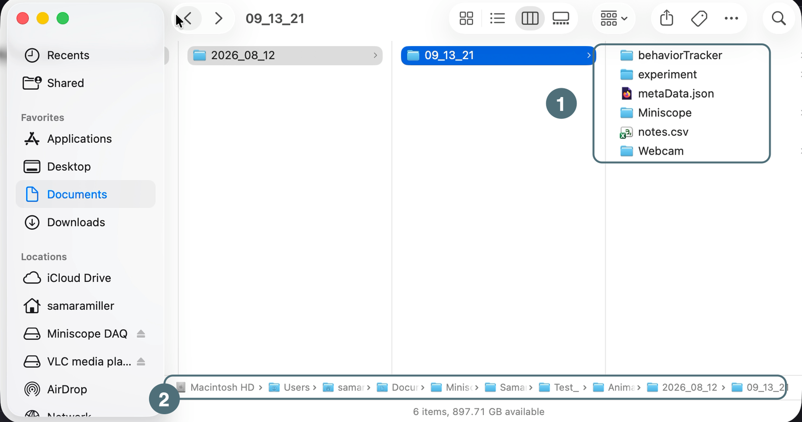
</p>

1. **Session level** — `metaData.json` (absolute start time), `notes.csv`, one folder per device, and `imageCaptures` for screenshots.
2. **The resolved path.**

<p align="center">
  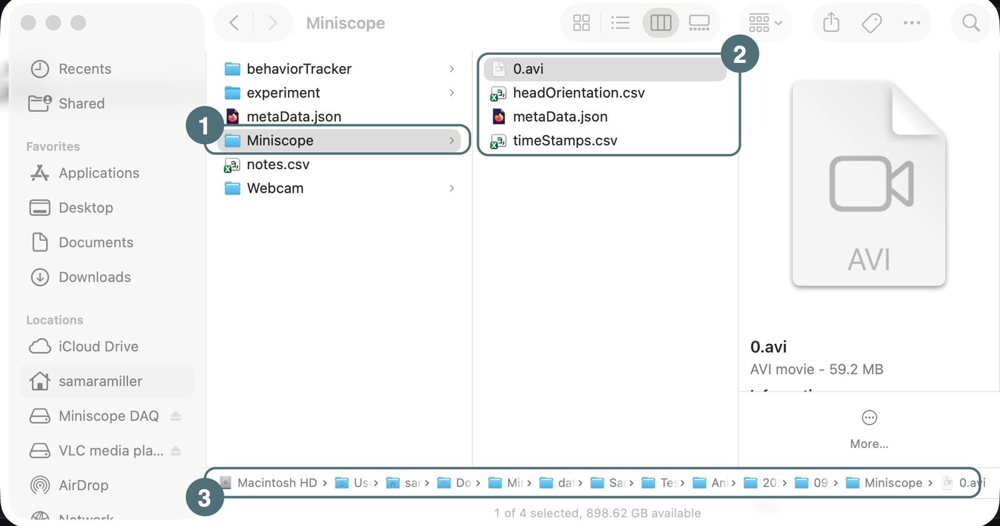
</p>

1. **One folder per device**, named from the configuration.
2. **`0.avi`** (rolling), **`timeStamps.csv`**, **`headOrientation.csv`** and that device's **`metaData.json`**.
3. **The full path.**

> [!NOTE]
> **Check the `DAQ Frame Number` column in `timeStamps.csv`.** It is the DAQ's own frame counter, and it should increment by exactly 1. A jump is on-disk proof that frames were lost between the DAQ and the software; a `-1` means that frame's read failed. It is the cheapest quality check on any recording.

The `.avi` files open in VLC or QuickTime for a look, or ImageJ/Fiji (*File → Import → AVI…*, with *Use Virtual Stack* checked) for analysis.

## Troubleshooting

Read the message panel first — most problems announce themselves there.

| Symptom | Check |
| --- | --- |
| macOS: "cannot verify the developer" / "is damaged" | The quarantine flag. Run the `xattr -dr` command in [Install](#install) |
| A device will not connect | Re-run **Scan devices** and confirm the ID. The message panel names the reason |
| Nothing found at all | The DAQ's three status LEDs, then that the DAQ firmware is current |
| Run is blocked | The **Config check** panel: usually colliding device names, or an unavailable codec |
| Buffer climbing, frames dropping | FFV1 → GREY; a direct USB 3 port rather than an unpowered hub; disk write speed |
| Recording will not start | Free space is below 500 MB |
| Image is a uniform grey field | Turn on **ΔF/F**, then check LED power and EWL focus |
| Bright small square, not even illumination | Hardware, not software — usually a missing half-ball lens. See [Miniscope V4 wiki](https://github.com/Aharoni-Lab/Miniscope-v4/wiki) |
| Commutator does not turn | Its card's **Enabled** switch, not just the port. The log names the missing link and lists ports |
| Trace pane never opens | The configuration has no trace sources — traces need a Miniscope or the behavior tracker |
| Behavior tracker does nothing | Not in any packaged build; build from source with `-DUSE_PYTHON=ON` |
| Linux: USB access error | Install the udev rule (see [Install](#install)) and re-plug |

**For a bug report,** set `MINISCOPE_LOG_FILE` to a path before launching and the app tees its log there — on Windows this is the only way to capture output. Attach that log, your configuration file, and the version string from the **Help** button.

## See also

- [README.md](README.md) — install details and platform notes
- [CHANGELOG.md](CHANGELOG.md) — what changed in this release
- [BUILD_MACOS.md](BUILD_MACOS.md) / [BUILD_LINUX.md](BUILD_LINUX.md) — building from source, including the optional behavior tracker
- [Miniscope V4 wiki](https://github.com/Aharoni-Lab/Miniscope-v4/wiki) — assembling, testing and debugging the scope itself
- [miniscope-io](https://github.com/Aharoni-Lab/miniscope-io) — the SDK that will supersede this software
